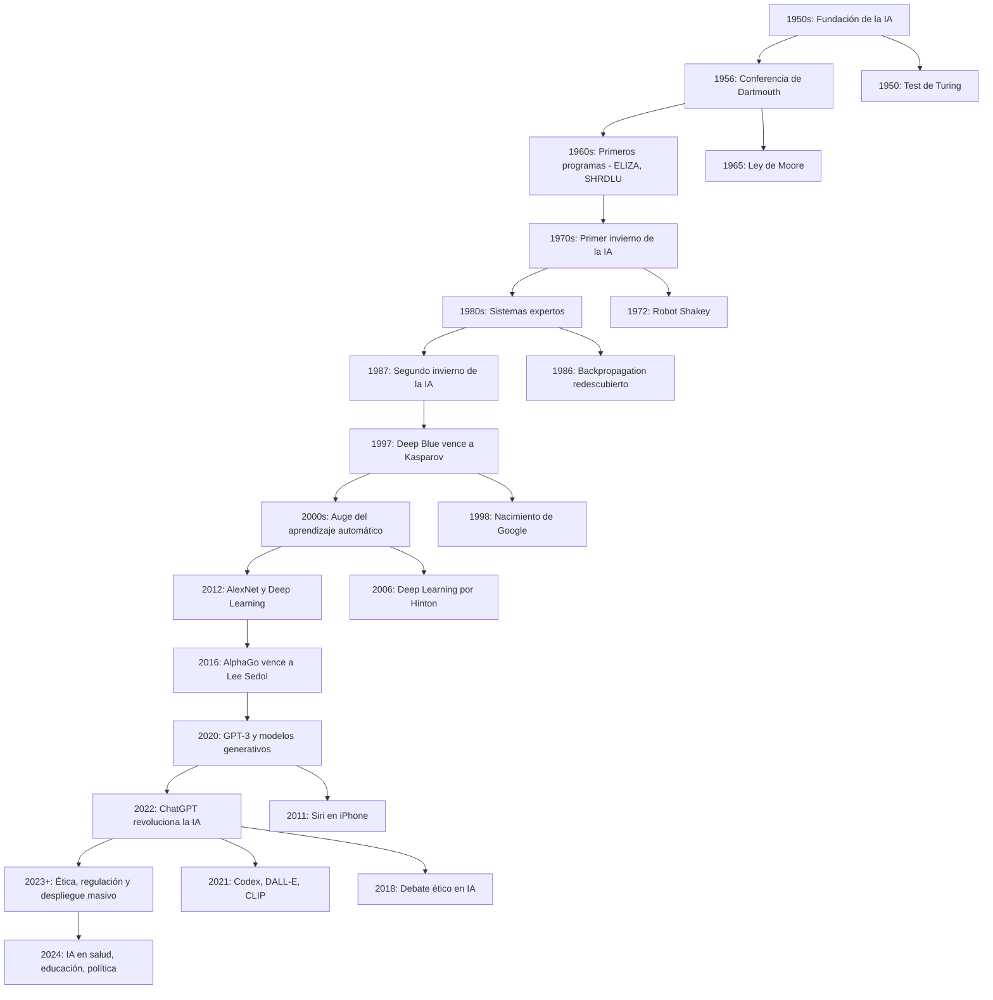

# Computer-Science-and-Artificial-Intelligence
This space to make an Computer Science and Artificial Intelligence 

# 1) DataBase
- [Learn about DataBase](https://github.com/wilmesis36/Computer-Science-and-Artificial-Intelligence/wiki/Data-Base)

# 2) Resources to CS and IA
- [Resource about Computer Science and Artificial Intelligence](https://github.com/wilmesis36/Computer-Science-and-Artificial-Intelligence/wiki/Resources-----Computer-Science-and--Artificial-Intelligence)

# 3) Research in CS
- [Research in CS](https://github.com/wilmesis36/Computer-Science-and-Artificial-Intelligence/wiki/Research)

# 4) Integration and Automatization 
- [Research in CS](https://github.com/wilmesis36/Computer-Science-and-Artificial-Intelligence/wiki/Research)
--------------------------------------------------------
- [Back to wilmesis36 ->](https://github.com/wilmesis36)
--------------------------------------------------------

